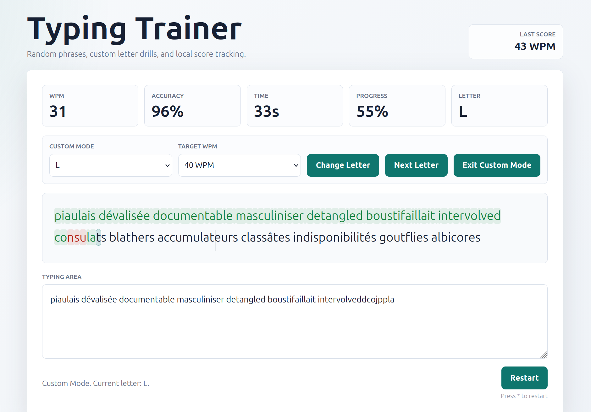

# Typing Trainer

A small browser-based typing trainer built for focused practice, quick restarts, and the kind of drills I kept wishing other typing sites had. Made with CODEX.

## Overview

Typing Trainer is a static web app for practicing speed and accuracy without creating an account, installing anything, or waiting for a backend. Open it in the browser, start typing, and the timer begins on the first keystroke.

The app has two main ways to practice:

- random English sentence practice for everyday typing rhythm
- custom letter drills that generate endless word sets containing a selected letter

It tracks WPM, accuracy, time, progress, the active practice letter, and the last completed score. There is also a target WPM selector with a visual pacing cursor, so you can practice typing at a specific rhythm instead of only chasing whatever score appears at the end. <br>

<div align="center">
  
</div>

<br>

## Live Demo

Try it here:

https://subhn-n.github.io/Typing-Trainer/

## Preview Image


## Why I Built This

I wanted a typing trainer that combined features I could never find together on a single website.

Most typing tools are good at one thing: random text, speed tests, lessons, or stats. I wanted something more specific: a simple trainer where I could warm up with random practice, switch into letter-focused drills, set a target pace, and restart instantly when a run felt messy, with a keypress.

The goal was not to build the biggest typing website. It was to build the one I would actually keep open while practicing.

## Features

- Random typing practice with short English phrases
- English interface
- WPM, accuracy, elapsed time, progress, and active-letter stats
- Last Score tracking after each completed run
- Restart button for quick resets
- `*` keyboard shortcut for restarting without reaching for the mouse
- Target WPM mode with selectable goals: 20, 40, 60, 80, 100, and 120 WPM
- Visual pacing guide that moves through the text at the selected target speed
- Custom Letter Mode for focused letter practice
- French and English dictionaries loaded from local JSON files
- Infinite word generation in Custom Letter Mode
- Letter switching with `Change Letter`, `Next Letter`, and `Exit Custom Mode`
- Responsive layout for desktop, tablet, and mobile screens
- Static-file architecture that works well on GitHub Pages

## Custom Letter Mode

Custom Letter Mode is the part I wanted most.

Pick a letter, press `Change Letter`, and the trainer builds a practice series where every word contains that letter. Finish the series exactly and a new one appears automatically. No menus, no lesson tree, no waiting around.

It is useful for practicing letters that feel awkward, slow, or easy to mistype. You can stay on one letter for as long as you want, move through the alphabet with `Next Letter`, or return to random phrase practice with `Exit Custom Mode`.

The word pool comes from local French and English dictionaries, then the app filters and shuffles matching words in the browser.

## Target WPM System

The Target WPM selector gives the session a pace, not just a final score.

Choose a target speed and a subtle cursor moves across the text at that rhythm. If your typing stays near the cursor, you are close to the selected pace. If it pulls away, you know exactly what is happening while you type instead of only finding out after the run.

Changing the target resets the current attempt, which keeps the timing clean.

## Technologies

- HTML
- CSS
- Vanilla JavaScript
- Local JSON dictionaries
- GitHub Pages-compatible static hosting

There is no framework, build system, backend, database, or external API. The project is intentionally small and easy to inspect.

## Local Usage

Because Custom Letter Mode loads local JSON files, the best way to run the project locally is with a small static server:

```bash
python3 -m http.server 8000 -d projects/typing-trainer
```

Then open:

```text
http://localhost:8000
```

Random phrase mode can also work by opening `index.html` directly, but the dictionary-powered mode needs the files to be served over HTTP in most browsers.

## Future Ideas

- Save more than one previous score
- Add optional best-score tracking per mode
- Add difficulty controls for shorter or longer word series
- Add a small mistake summary after each run
- Add keyboard-focused controls for changing letters and target speed
- Add more practice text without making the app feel heavy

The project is deliberately simple for now. The next features should make practice better, not turn it into a dashboard.
